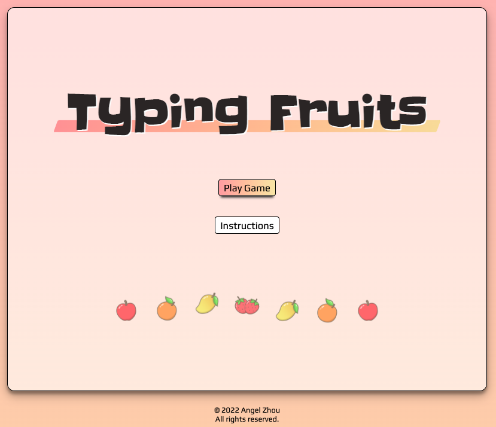
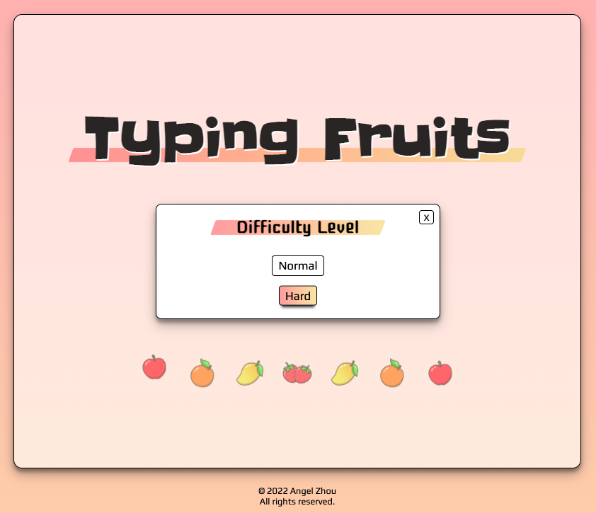
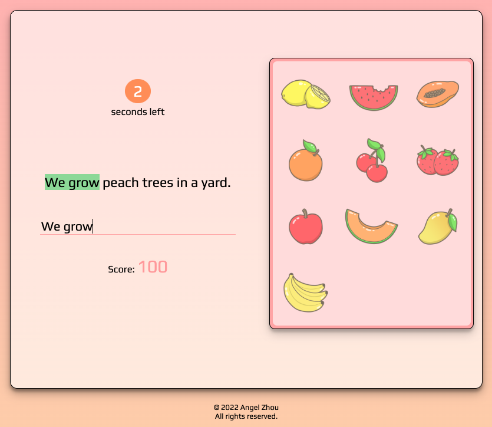
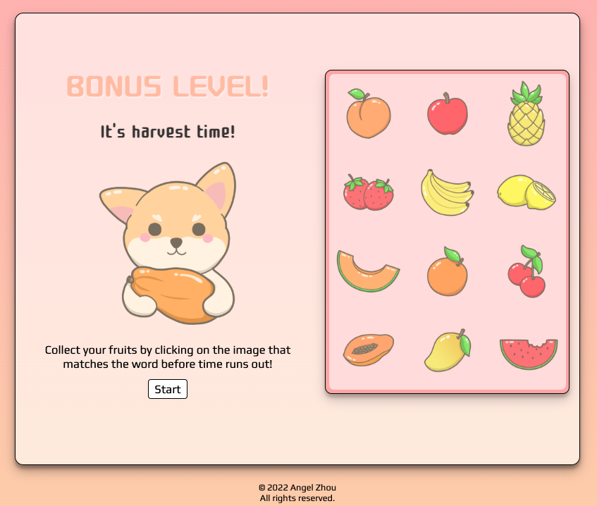
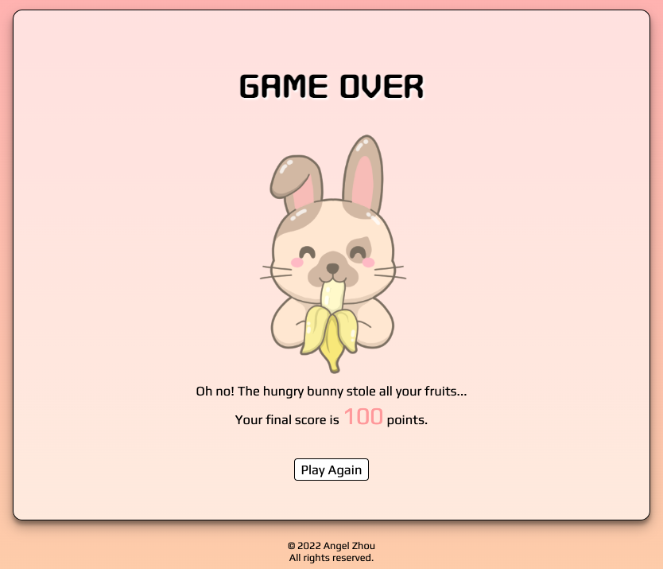

# Typing Fruits Game

## OVERVIEW

This is an educational, kid-friendly browser game that aims to teach kids to identify and spell various fruits while honing their typing skills! There are two difficulty levels in the game - normal and hard. The latter difficulty is for those who are up for a challenge.
The idea was inspired by my background in education merged with my passion for digital illustration. 

### Link
https://angel-zh.github.io/typing-fruits-game/

### Technology
- HTML5
- CSS
- JavaScript


## USER STORIES

### Part I - Type type type!
```
As a user, I want the ability to...
- view the instructions/rules of the game
- select the level of difficulty
- start the game when I'm ready to play
- see the timer/countdown
- type the prompt shown on the screen with my keyboard
- advance to the next level after successful match
- see the "game over" screen
- see the fruit(image) that I've collected after each level
- advance to Part II (Bonus Level) of the game once I clear all levels in Part I
```

### Part II Bonus Level - Match match match!
```
As a user I want the ability to...
- start the Bonus Level of the game after beating Part I
- click on start when I am ready
- see the prompt and click the matching fruit image 
- advance to the next prompt after successful match
- reach the end of the game
- restart to play again
```

## SCREENSHOTS







  

## GAME MECHANICS

This game incorporates the use of text inputs (strings) and mouse click events to navigate through the levels. There are two pre-determined arrays of prompts, which also serve as a check for winning conditions, for two levels of difficulty respectively. An object will be used to store all word-image key-value pairs.

### Functions

Some of the functions used in the game:

- displayPrompts - displays prompts in randomized non-repeating order
- highlightLetters - highlights correct letters as user types
- compareTextInput - checks user input against prompt
- runTimer - sets the timer for each input
- compareClickedImg - handles image clicks to determine a match
- resetGame - resets game to initial state
- initGame - holds logic of game and invokes functions to run game


## Credits
All images in the game were digitally drawn by me.